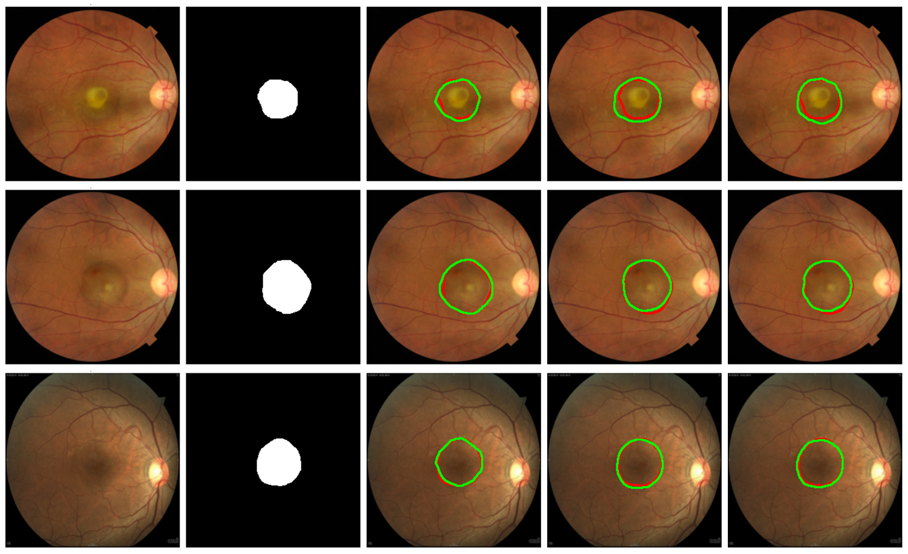

# BATS-Net: A Lightweight Boundary-Aware Transition Statistics Network for Subretinal Fluid Segmentation in Fundus Images

Implementation of **BATS-Net**, a lightweight deep learning framework for **subretinal fluid (SRF) segmentation in fundus images**.

---

# Abstract

Accurate delineation of **Central Serous Chorioretinopathy (CSC)** lesions in fundus images is essential for disease monitoring and treatment assessment, yet remains challenging due to subtle appearance variations, diffuse boundaries, and low contrast between affected and healthy retinal regions.

We propose **BATS-Net**, a lightweight **Boundary-Aware Transition Statistics Network** that formulates SRF segmentation as a **transition-statistics learning problem**. The proposed framework explicitly models:

* **First-order local appearance deviation**
* **Second-order feature variance**

to characterize **boundary instability and texture heterogeneity** in fundus images.

These compact transition representations are refined through a **transition encoder** and a **multi-scale spatial coherence module**, enabling robust contextual aggregation for accurate SRF boundary delineation.

Experiments on a manually annotated CSC fundus dataset demonstrate that **BATS-Net achieves competitive segmentation performance while reducing model parameters by nearly 60–70× compared to heavy encoder–decoder architectures**, making it suitable for efficient clinical deployment and large-scale screening.

---

# Method Overview

The proposed **BATS-Net** architecture consists of four main components:

1. Texture Encoder
2. Transition Statistics Modeling
3. Spatial Coherence Module
4. Segmentation Prediction Head

---

# Network Architecture


*Figure: Architecture of the proposed BATS-Net. The network models local transition statistics and refines them using spatial coherence for accurate SRF segmentation.*

---

## Architecture Pipeline

```
Fundus Image
     │
     ▼
Texture Encoder
     │
     ▼
Transition Statistics Modeling
  (Appearance Deviation + Feature Variance)
     │
     ▼
Transition Encoder
     │
     ▼
Spatial Coherence Module
 (Dilated Convolutions)
     │
     ▼
Segmentation Head
     │
     ▼
SRF Segmentation Mask
```

---

# Dataset

Experiments were conducted on a **manually annotated CSC fundus dataset**.

The dataset contains:

* **1050 fundus images**
* **Pixel-level SRF segmentation masks**

Each dataset sample contains the **fundus image and mask concatenated into a single image file**.

During preprocessing:

* **Left half → Fundus image**
* **Right half → Ground truth mask**

---

## Dataset Statistics

| Property         | Value               |
| ---------------- | ------------------- |
| Total Images     | 1050                |
| Training Images  | 735                 |
| Testing Images   | 315                 |
| Image Resolution | 256 × 256           |
| Annotation       | Pixel-wise SRF mask |

---

# Installation

### Requirements

* Python ≥ 3.8
* PyTorch
* NumPy
* OpenCV
* Matplotlib
* scikit-learn

---

# Training Details

The model is implemented in **PyTorch**.

### Hyperparameters

| Parameter     | Value             |
| ------------- | ----------------- |
| Batch size    | 4                 |
| Epochs        | 200               |
| Optimizer     | Adam              |
| Learning rate | 1e-4              |
| LR Scheduler  | ReduceLROnPlateau |

### Data Augmentation

* Random horizontal flips
* Random vertical flips

---

# Loss Function

The network is trained using a hybrid loss:

```
L = λ1 * BCE + λ2 * Dice
```

where

* **BCE Loss** handles pixel-wise classification
* **Dice Loss** addresses class imbalance

---

## Quantitative Comparison

| Method                  | Precision (%) | Recall (%) | Dice Score | IoU        | Accuracy (%) | Params (M) | FLOPs (G) | Inference Time (ms) |
| ----------------------- | ------------- | ---------- | ---------- | ---------- | ------------ | ---------- | --------- | ------------------- |
| U-Net + pix2pix         | 86.20         | 70.20      | 0.7646     | 0.6190     | 96.04        | 31.04      | 54.74     | 69.84               |
| Original U-Net          | 82.00         | 70.30      | 0.7349     | 0.5810     | 93.50        | 31.03      | 54.61     | 69.12               |
| Classic FCN (FCN-8s)    | 82.40         | 70.60      | 0.7357     | 0.5820     | 94.30        | 134.40     | 70.28     | 80.62               |
| U-Net + CBAM            | 92.87         | 85.83      | 0.8894     | 0.7978     | 98.12        | 31.21      | 54.76     | 107.93              |
| U-Net++                 | 94.93         | 91.45      | 0.9186     | 0.8690     | 98.71        | 36.63      | 138.66    | 177.36              |
| DeepLabv3+              | 95.32         | 94.25      | 0.9285     | 0.8667     | 99.14        | 40.35      | 78.50     | 66.60               |
| **BATS-Net (Proposed)** | **93.12**     | **90.82**  | **0.9194** | **0.8510** | **98.78**    | **0.58**   | **1.85**  | **30.84**           |

BATS-Net achieves **competitive performance with significantly fewer parameters and computational cost**.

---

## Ablation Study

Evaluation of the contribution of individual components in **BATS-Net**.

| Texture Encoder | Appearance Deviation | Feature Variance | Transition Encoder | Spatial Coherence | Segmentation Head | Precision (%) | Recall (%) | Dice       | IoU        | Accuracy (%) |
| --------------- | -------------------- | ---------------- | ------------------ | ----------------- | ----------------- | ------------- | ---------- | ---------- | ---------- | ------------ |
| ✓               | ×                    | ×                | ×                  | ×                 | ✓                 | 71.57         | 24.90      | 0.2061     | 0.1353     | 87.41        |
| ✓               | ✓                    | ×                | ✓                  | ×                 | ✓                 | 87.56         | 89.45      | 0.8719     | 0.7854     | 97.78        |
| ✓               | ×                    | ✓                | ✓                  | ×                 | ✓                 | 85.17         | 88.93      | 0.8576     | 0.7651     | 97.61        |
| ✓               | ✓                    | ✓                | ✓                  | ×                 | ✓                 | 90.28         | 88.41      | 0.8934     | 0.8072     | 97.67        |
| ✓               | ✓                    | ✓                | ✓                  | ✓                 | ✓                 | **93.12**     | **90.82**  | **0.9194** | **0.8510** | **98.78**    |

---

# Qualitative Results



*Example qualitative segmentation results. From left to right: Input fundus image, ground truth mask, predictions from the proposed BATS-Net, U-Net++ and DeepLabv3+.*

The proposed BATS-Net produces segmentation masks that closely match expert annotations while preserving lesion boundary details.
